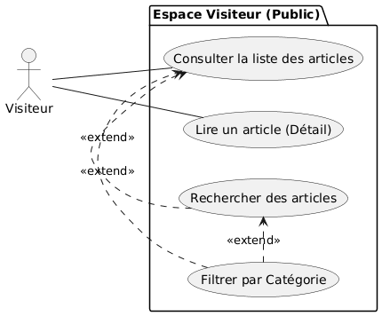

# **Projet Blog Solicode**
## Sprint 1

**Réalisé par :**  
Anouar Benyakhlef  
Abdelhay Mellouli
Mohamed Ouallou

**Encadré par :**  
M. Essarraj Fouad

---

# Besoin

Solicode a besoin de communiquer sur ses activités via un canal numérique centralisé et maîtrisé.  
Les réseaux sociaux ne suffisent plus : besoin de référencement, de structuration et d’une identité propre.

### La Solution  
Une plateforme de blog dynamique, sécurisée et scalable, accompagnée d’une application mobile permettant de notifier les utilisateurs en temps réel.

La plateforme se compose de 4 modules interconnectés.  
Dans ce sprint, nous avons démarré et réalisé le **Module 1**.

---

# Module 1 : Portail Web Public (Front-Office)

Interface visible par les visiteurs permettant :

- Page d’accueil
- Navigation
- Recherche avancée
- Lecture d’articles immersive

---

# Fonctionnalités (Use Cases – Sprint 1)

Le Sprint 1 implémente les fonctionnalités essentielles constituant le **MVP (Minimum Viable Product)**.

---

# Labs (Ateliers Pratiques Réalisés)

Afin de mener à bien ce projet, plusieurs ateliers techniques ont été réalisés :

- **Lab 1 : Vite**  
  Mise en place de la structure du projet et configuration initiale, avec focus sur le responsive design via Bootstrap.

- **Lab 2 : Ajax**  
  Mise en place du serveur et des routes API pour la gestion des articles.

- **Lab 3 : Github**  
  Gestion de versions, collaboration, résolution d’erreurs et synchronisation du code.

- **Lab 4 : PHP Naming Conventions**   
  Structuration du code, bonnes pratiques de nommage, tests unitaires et correction de bogues.

---

# Maquettes (Mockups)

Les maquettes définissent l’interface utilisateur afin d’assurer une expérience claire, moderne et intuitive.  
Nous avons utilisé Tailwind + Preline UI pour le design initial.

### Représentation Visuelle

---

---

---

# Diagramme de Classe

Le diagramme de classe modélise la base de données et définit les entités principales ainsi que leurs relations.

---

# Réalisation Technique

### Back-End & Architecture
- Framework : **Laravel 12**
- Architecture : **N-Tiers (Controller → Service → Model)**

### Front-End (Web)
- Moteur de template : **Blade (Components & Layouts)**
- CSS : **Tailwind CSS**
- UI Kit : **Preline UI**

---

# Conclusion

Le Sprint 1 a permis de poser des bases solides pour la plateforme **Blog Solicode** :
- Structure claire  
- Architecture scalable  
- Expérience utilisateur bien définie  

Les prochains sprints se concentreront sur :
-  L'Administration (Back-Office) - Le centre de contrôle sécurisé pour les gestionnaires.
- s API REST (Le Pont) - L'interface d'échange de données.
- Application Mobile (Android) - L'extension native pour la fidélisation.  

Merci pour votre attention.
Questions ?